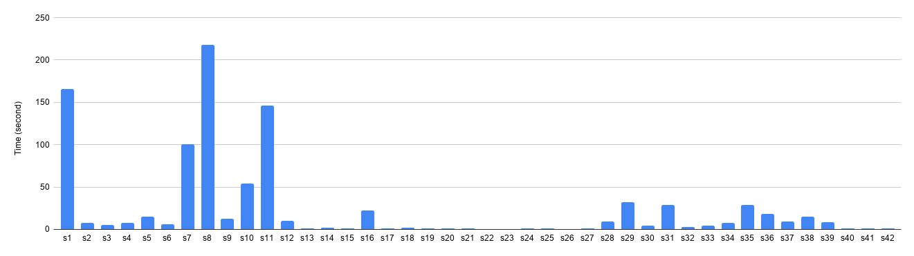

# Trusted Command Specification Generator

## Inputs for Trusted Command Specification (TCS) Generator

This tool derives all the trusted command specifications used in the paper (4.1. Instrumentation Phase).

Inputs for the TCS generator for all 42 applications we evaluated can be found in the folder [`inputs`](./inputs).
* The sink functions, environment, configuration APIs can be obtained from our paper (e.g., Table 1 and 3 in the paper).
* For the trusted folder (e.g., `/var/www/`), the user provides a web server's base folder, which a typical server administrator can provide.
	* For web servers that run CGI (Common Gateway Interface), such as s7 (Lighttpd) and s10 (Goahead), the folder for CGI needs to be added.  A typical input path can be `/var/www/cgi-bin`, which a typical server administrator can provide as well.

## Time to generate TCS for each application.

The execution time of our tool is shown in the below table. Generating TCS for Leptonica (s8) took the longest time: 217.75 seconds, which is 3 min 37.75 seconds.

| ID     |   Time (s) |     | ID  | Time (s) |     | ID  | Time (s) |
| :----- | ---------: | --- | :-- | -------: | --- | :-- | -------: |
| s1     |     165.59 |     | s15 |     1.25 |     | s29 |    31.96 |
| s2     |       7.82 |     | s16 |    22.29 |     | s30 |     4.13 |
| s3     |       5.18 |     | s17 |     1.18 |     | s31 |    29.24 |
| s4     |       7.99 |     | s18 |     1.59 |     | s32 |     2.88 |
| s5     |      14.73 |     | s19 |     1.14 |     | s33 |     4.71 |
| s6     |       6.23 |     | s20 |     1.22 |     | s34 |     7.31 |
| s7     |     100.32 |     | s21 |     0.83 |     | s35 |    28.64 |
| **s8** | **217.75** |     | s22 |     0.75 |     | s36 |    18.38 |
| s9     |      12.28 |     | s23 |     0.74 |     | s37 |     9.23 |
| s10    |      54.02 |     | s24 |     1.17 |     | s38 |    15.19 |
| s11    |     146.36 |     | s25 |     1.35 |     | s39 |     8.28 |
| s12    |       9.76 |     | s26 |     0.58 |     | s40 |     0.98 |
| s13    |       1.18 |     | s27 |     1.28 |     | s41 |     1.19 |
| s14    |       1.61 |     | s28 |     9.68 |     | s42 |     0.87 |
